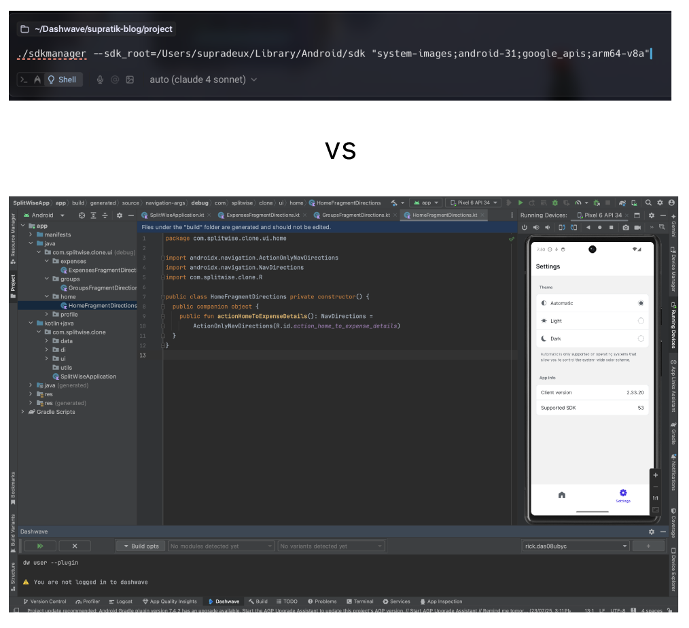

import TweetEmbed from "@/components/TweetEmbed.astro";

A few months before writing this post, the folks at [Dashwave](https://dashwave.io) undertook a sprint to take up engineering challenges from across domains and try to accomplish them with the minimal amount of human code being written. We also took up popular prompt-to-code IDEs/editors just to have a decent comparison. And in this pursuit, not just the developers, but many non-developers, including my co-founder (who is an experienced product manager), participated. And this led to many interesting insights, some of which would shape how I currently look at the future of prompt-to-code tools.

_It had always been an AI problem statement._ This cannot be an understatement, as the graph of such tools has witnessed a trajectory similar to the intelligence levels of the frontier AI models.

Take GitHub Co-Pilot, for example, when we truly began to witness how powerful it can be to aid in the workflow of an engineer. Most of the readers would have a good idea, so I won’t demonstrate more. **But the intention of the tool was pretty straightforward - to assist the developer, reduce monotonicity.** And for all means, it was amazing. Then came the era of powerful LLMs, and that gave way to Cursor, which in its early days was an even more powerful developer assistant. And along with it came a multitude of other tools and IDE extensions like Cline, Windsurf and so forth. If you have followed along, you can see the impact of the evolving intelligence of the frontier models had on these tools. And it was pretty easy to guess, because the UI, the purpose of these tools was to assist the developers. More powerful models meant more tailored, more complex assistance. Also, that means these cannot be categorised under the modern segment of AI Agents.

Sorry to wander off the study, now back to the experiment that we undertook. Our goals with Dashwave, like many other prompt-to-app platforms, have always been on a different, more ambitious vertical - can a guided AI agent build actual, usable, monetisable products? And I use the term ‘Agent’ here because, as opposed to code-assistants, product development is never linear, it involves many decision-making, ad-hoc referencing, and collaboration - hence the ideal capabilities of an agent. Beautifully enough, many such platforms have already emerged and become unicorns, like Cursor’s agent mode, Windsurf’s cascade mode, Bolt, Lovable, etc.

And as I had already expected, there was a point where the project was complex enough that both the operator and the agent started struggling. These experiences varied across personas.
Just to put everything into context, all the tools currently have a similar interface, a chat-panel where the AI responses, tool use and multiple threads can be viewed, and an editor panel (often a VSCode fork for viewing the code)

**The non-developer persona (ideally a PM):** They are used to communicating in flows - Whimsical/FigJam being their go-to tools. So even before the emergence of doom-fix loops, when the project grew complex, many criticalities arose, like - do we create a unique conversation thread for every feature being developed to effectively use context? What if a feature is a child feature of an existing feature? How to prevent and predict context-rot? And very soon, the project became a mess, with 600+ line files and Cursor giving up with “The implementation of this feature is currently very messy” ← The same feature which it itself implemented in a previous conversation.

**The developer persona:** The devs (like me) have been using coding assistants, so the interface looked familiar. And from an engineer’s perspective, the component hierarchy was already in place in the AI instructions. But thread management was a mess, as expected, because devs are still viewing them as a coding assistant but expect the work of an agent. Multiple-feature implementations dumped in the same file, duplicate implementations of the same component when it was referenced somewhere else, but the RAG couldn’t find it. But the main breaking point was debugging the very own codebase that it created - With redundant implementations of components, no reliable integration with runtime logs - it kept fixing a non-imported component and wondering why the logs weren’t visible, until I had to step in and inform about the mistake.

And with all these experiences, a major question emerged: **Why do these Agent platforms, even though built with the intention of being increasingly autonomous and decisive, have the same workflow and user interface as that of coding assistants?**

I am quite convinced that the current AI models have the requisite intelligence to perform their delegated tasks with finesse - a discussion in the direction of vertical agent integration. And hence, it is not entirely an intelligence or, for that matter, a context window problem. Just to bring everything into perspective, debuggers and linters have existed since the age of primitive terminal-based code editors (or even older). But it is IDEs that brought ease in their usage, while re-imagining the interface on the legacy constructs of programming. A very striking example is how Android apps are developed and debugged. Can you use CLI tools to achieve everything - likely yes, do devs prefer to build apps without Android Studio - absolutely NO!

So my proposed timeline of AI coding agents suggests that we are in the terminal-editor era of software development with these agents. The interface in which they are operated would bring a great evolution in their capability of developing complex software. 

<TweetEmbed url="https://x.com/karpathy/status/1917920257257459899" />

This interface would demand an introspection of the actual workflow of a software engineer or a team of engineers:

- How engineers plan out the features/components
- How engineers define a module hierarchy
- How engineers come up with a construct to debug a complex module
- And most importantly, how engineers derive and relay context from various sources like runtime logs, build logs, visual feedback and utilise them to make conscious decisions/alterations in the workflow

And hence, actual classic software engineers, working in teams, are the best persona that should be studied, to re-imagine the interface of the software engineering AI agents. I can already see Amazon’s Kiro making the right strides in this direction. The folks at Dashwave have already started treading on this path.

The IDE era of the AI SWE Agents is yet to come. I will be writing more on this topic with a few suggested workflows/interfaces that we believe can be extrapolated to get tremendously good results. The future looks absolutely exciting, with many foundational and generational inventions coming up in this domain!
